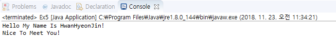

RESUME
====================  
>### Name : HwangHyeonJin  
>>School : Hallym University  
>>>Department : LifeScience / Computer Science 
Grade : 2th
------------------------
#### CLASS 
- 오소리(오픈소스리눅스)  
- 자바프로그래밍  
- 진화학  
- 기초화학연습ii  
- 생화학
- 기초분자생물학  
 -------------------------
##### INTEREST   
- Seucurity 보안  
- Programming 프로그래밍  
- Design 디자인 
- Ornithology 조류학
##### LANGUAGE
- Korean
- English
- Java  

- Linux  
##### ACTIVITY
- K-Bon Junior
 ------------------------
               /)    /)
              / )   / )
             /  )  /  )
            (           )
          (    ●      ●  )
          (        ◇     )
토         (             )          끼
          (                )
         (                  )
      ( )(    u         u  )
          (               )

 ------------------------
추천 사이트  
[google][1]  
[google](https://www.goggle.com)  
<https://www.hallym.ac.kr  

[1]: https://www.goggle.com  

--------------------------  
    
------------------------------  
 1|2  
--|--  
 3|4  
