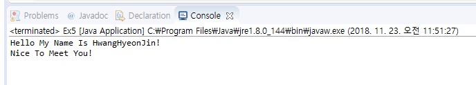
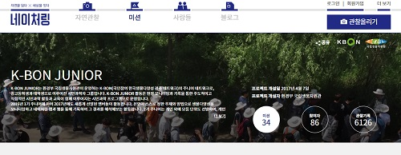

RESUME
====================  
>### Name : HwangHyeonJin  
>>School : Hallym University  
>>>Department : LifeScience / Computer Science 
Grade : 2th
------------------------

#### CLASS 
- OpenSourceLinux   
- JavaProgramming    
- Evolution  
- Basic Chemistry 2  
- Biochemistry  
- Molecular Biology  
- Human And Computer  
- Odyssey Seminar 2  
 -------------------------
##### INTEREST   
- Programming   

- Design   
- Ornithology    

##### LANGUAGE  
- Korean  
- English  
- Java  

- Linux  

##### ACTIVITY  
- K-Bon Junior  

- X - Tric  
- fimp
 ------------------------  
               /)    /)
              / )   / )
             /  )  /  )
            (           )
          (    ●      ●  )
          (        ◇     )
토         (             )          끼
          (                )
         (                  )
      ( )(    u         u  )
          (               )

 
